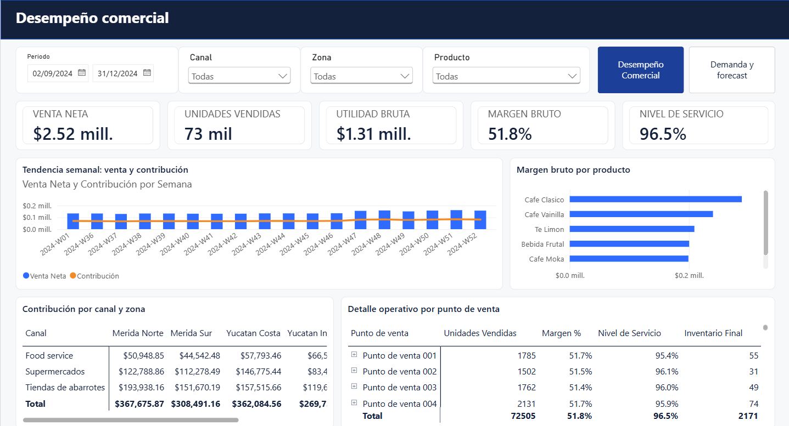

# Beverage Commercial Decision Lab

**End-to-end commercial analytics project for the beverage industry**  
Python - SQL - Forecasting - Price Elasticity - Excel - DAX - Power BI

[English](#english-version) | [Español](#version-en-espanol)



> **Data notice / Aviso sobre los datos:** This project uses fully synthetic data generated for analytical demonstration purposes. It does not contain information from, represent the policies of, or provide recommendations for any real company. / Este proyecto utiliza exclusivamente datos sintéticos generados para fines demostrativos y analíticos y no contiene información ni representa las políticas o recomendaciones de una empresa real.

---

<a id="english-version"></a>

## English version

### Project overview

The **Beverage Commercial Decision Lab** is an end-to-end commercial analytics project focused on beverage portfolio management.

It combines descriptive analytics, demand forecasting and price simulation to evaluate business decisions in terms of volume, revenue, contribution, margin and operational execution.

The project was designed to answer four business questions:

1. How are sales, contribution and service levels evolving across products, channels and regions?
2. Which forecasting approach provides the most reliable short-term demand baseline?
3. How could a price change affect demand, revenue and contribution across the portfolio?
4. How should analytical results be translated into a practical commercial monitoring routine?

### Key results

- **37,440 observations:** 104 weeks, 60 points of sale, 6 SKUs, 3 channels and 4 regions.
- **MXN 15.38 million** in net revenue and **MXN 8.02 million** in contribution within the synthetic dataset.
- Overall contribution margin of **52.2%** and service level of **96.3%**.
- Best global forecasting benchmark: **8-week moving average**, with **5.8% WAPE** and **+4.0% Bias**.
- A simulated **10% discount on Café Clásico** increases portfolio volume by **1.9%**, while revenue decreases by **0.5%** and contribution by **2.6%**.
- Commercial interpretation: the simulated promotion creates **volume without value**. A smaller discount or a targeted test by channel and point of sale should be evaluated.

### Analytical workflow

```text
Synthetic commercial data
          =>
Data model and quality controls
          =>
Descriptive analysis and SQL
          =>
Demand forecasting and price elasticity
          =>
Excel what-if simulation
          =>
Power BI operating model and executive communication
```

### Project components

| Component | File | Purpose |
|---|---|---|
| Synthetic dataset | [`data/fact_sales.csv`](data/fact_sales.csv) and dimensions | Reproducible sales, pricing, service and inventory data |
| Data dictionary | [`data/Diccionario_de_Datos.md`](data/Diccionario_de_Datos.md) | Grain, definitions and data-quality rules |
#| Excel simulator | [`excel/Simulador_Precios_Bebidas.xlsx`](excel/Simulador_Precios_Bebidas.xlsx) | What-if analysis of discounts, elasticity, cannibalization and contribution |
| Forecasting notebook | [`notebook/Modelado_Demanda_Elasticidad.ipynb`](notebook/Modelado_Demanda_Elasticidad.ipynb) | Forecast comparison and log-log price-elasticity estimation |
| SQL analysis | [`sql/Analisis_Comercial.sql`](sql/Analisis_Comercial.sql) | KPIs, product ranking, forecast accuracy, operational risk and quality controls |
| DAX measures | [`powerbi/Medidas_DAX.md`](powerbi/Medidas_DAX.md) | Commercial, service-level and forecasting measures |
| Power BI wireframe | [`powerbi/PowerBI_Wireframe.md`](powerbi/PowerBI_Wireframe.md) | Dashboard pages, visual positions, fields and interaction rules |
#| Executive case study | [`executive/Carlos_Segura_Caso_Analitica_Bebidas.pdf`](executive/Carlos_Segura_Caso_Analitica_Bebidas.pdf) | Six-slide executive summary |
#| Editable presentation | [`executive/Carlos_Segura_Caso_Analitica_Bebidas.pptx`](executive/Carlos_Segura_Caso_Analitica_Bebidas.pptx) | Editable presentation with speaker notes |

### Data model

The fact table uses a **week × point of sale × SKU** grain.

Date, product and customer dimensions form a star schema. Forecasting and elasticity outputs are stored separately to preserve traceability and simplify their use in business-intelligence tools.

Core commercial variables include:

- units ordered, delivered and sold;
- list price, discount and net price;
- revenue, cost of sales and contribution;
- opening and ending inventory;
- promotion flag and numeric distribution.

### Forecasting methodology

Three forecasting approaches are compared using an eight-week holdout period:

- seasonal naïve;
- 8-week moving average;
- additive Holt-Winters.

Models are evaluated using:

- Mean Absolute Error — MAE;
- Root Mean Squared Error — RMSE;
- Weighted Absolute Percentage Error — WAPE;
- forecast Bias.

The objective is not to select the most complex method, but to identify a stable and explainable operating benchmark.

The 8-week moving average achieves the lowest global WAPE. Holt-Winters produces a nearly identical WAPE with a lower Bias, which suggests that model selection should also consider systematic over- or under-forecasting at the SKU level.

### Price-elasticity methodology

Own-price elasticity is estimated through a demonstrative log-log specification with controls for:

- promotion;
- numeric distribution;
- channel;
- region.

The estimated coefficients provide a structured input for scenario exploration, but they should not be interpreted as causal effects without further validation.

A production-level pricing analysis would also need to address:

- price endogeneity;
- product availability;
- promotional mechanics;
- competitive prices;
- portfolio mix;
- controlled experiments or quasi-experimental designs.

### Excel what-if simulator

#The Excel simulator combines:

#- estimated own-price elasticities;
#- cross-product substitution and cannibalization assumptions;
#- baseline prices, costs and volumes;
#- user-defined discount scenarios;
#- portfolio-level revenue and contribution calculations.

#Editable inputs are highlighted in yellow. Calculated results show the expected effect on:

#- price;
#- volume;
#- net revenue;
#- contribution;
#- total portfolio performance.

#The simulator is intended for scenario exploration. It should not be interpreted as a causal pricing recommendation without additional #validation.

### SQL analysis

The SQL file includes examples for:

- weekly commercial-performance reporting;
- product ranking by contribution;
- promotional-performance comparisons;
- forecast-accuracy measurement;
- service-level and inventory-risk identification;
- product and customer catalog controls;
- point-of-sale opportunity analysis.

### Power BI operating model

The Power BI documentation includes:

- proposed star-schema relationships;
- commercial and forecasting DAX measures;
- two dashboard wireframes;
- exact visual positions;
- visual fields;
- filter behavior;
- interaction rules;
- conditional formatting;
- validation totals.

The proposed dashboard contains two pages:

1. **Commercial Performance**
   - revenue;
   - units;
   - contribution;
   - margin;
   - service level;
   - product, channel and regional performance;
   - point-of-sale opportunity and risk.

2. **Demand and Forecast**
   - WAPE;
   - Bias;
   - future demand;
   - SKU-level forecast accuracy;
   - forecast detail;
   - operational alerts.

### Run locally

Requirements: Python 3.11 or later.

```bash
python -m venv .venv
```

Activate the environment on Windows PowerShell:

```powershell
.venv\Scripts\Activate.ps1
```

Activate the environment on macOS or Linux:

```bash
source .venv/bin/activate
```

Install the dependencies:

```bash
pip install -r requirements.txt
```

Generate the synthetic dataset and analytical outputs:

```bash
python src/build_analysis.py
```

Open the notebook:

```bash
jupyter notebook notebook/Modelado_Demanda_Elasticidad.ipynb
```

The Excel simulator, PowerPoint presentation and PDF case study are already built and can be reviewed without executing code.

### Limitations

- All data and elasticities are synthetic and do not describe a real market.
- The elasticity approximation is intended for moderate price changes.
- Cross-product substitution and cannibalization coefficients are scenario assumptions.
- The forecast comparison uses a limited holdout horizon.
- Production deployment would require rolling backtesting and continuous monitoring.
- The Power BI deliverable includes detailed wireframes, DAX measures and interaction rules, but not a final `.pbix` file.
- The results demonstrate analytical structure and decision reasoning, not guaranteed business impact.

---

<a id="version-en-espanol"></a>

## Versión en español

### Descripción del proyecto

**Beverage Commercial Decision Lab** es un proyecto integral de analítica comercial enfocado en la gestión de un portafolio de bebidas.

Combina análisis descriptivo, pronóstico de demanda y simulación de precios para evaluar decisiones de negocio en términos de volumen, venta, contribución, margen y capacidad de ejecución.

El proyecto fue diseñado para responder cuatro preguntas de negocio:

1. ¿Cómo evolucionan la venta, el margen bruto y nivel de servicio por producto, canal y zona?
2. ¿Qué método proporciona la línea base más confiable para anticipar la demanda de corto plazo?
3. ¿Cómo podría un cambio de precio afectar el volumen, la venta y la el margen del portafolio?
4. ¿Cómo deben traducirse los resultados analíticos en una rutina práctica de seguimiento comercial?

### Resultados principales

- **37,440 observaciones:** 104 semanas, 60 puntos de venta, 6 SKU, 3 canales y 4 zonas.
- **MXN 15.38 millones** de venta neta y **MXN 8.02 millones** de contribución dentro del universo sintético.
- Margen de contribución de **52.2%** y nivel de servicio de **96.3%**.
- Mejor benchmark global de forecast: **promedio móvil de 8 semanas**, con **WAPE de 5.8%** y **Bias de +4.0%**.
- Un escenario de **10% de descuento en Café Clásico** aumenta el volumen del portafolio **1.9%**, mientras la venta disminuye **0.5%** y la contribución **2.6%**.
- Interpretación comercial: la promoción simulada genera **volumen sin valor**. Convendría evaluar un descuento menor o una prueba segmentada por canal y punto de venta.

### Flujo analítico

```text
Datos comerciales sintéticos
            =>
Modelo de datos y controles de calidad
            =>
Análisis descriptivo y SQL
            =>
Forecast de demanda y elasticidad de precio
            =>
Simulación What-If en Excel
            =>
Modelo operativo en Power BI y comunicación ejecutiva
```

### Componentes del proyecto

| Componente | Archivo | Propósito |
|---|---|---|
| Dataset sintético | [`data/fact_sales.csv`](data/fact_sales.csv) y dimensiones | Datos reproducibles de ventas, precio, servicio e inventario |
| Diccionario de datos | [`data/Diccionario_de_Datos.md`](data/Diccionario_de_Datos.md) | Granularidad, definiciones y reglas de calidad |
| Notebook analítico | [`notebook/Modelado_Demanda_Elasticidad.ipynb`](notebook/Modelado_Demanda_Elasticidad.ipynb) | Comparación de forecast y estimación log-log de elasticidad |
| Consultas SQL | [`sql/Analisis_Comercial.sql`](sql/Analisis_Comercial.sql) | KPI, ranking, precisión del forecast, riesgo operativo y controles de calidad |
| Medidas DAX | [`powerbi/Medidas_DAX.md`](powerbi/Medidas_DAX.md) | Medidas comerciales, de servicio y forecast |
| Wireframe de Power BI | [`powerbi/PowerBI_Wireframe.md`](powerbi/PowerBI_Wireframe.md) | Páginas, posiciones, campos e interacciones del dashboard |

### Modelo de datos

La tabla de hechos utiliza una granularidad de **semana × punto de venta × SKU**.

Las dimensiones de fecha, producto y cliente forman un esquema estrella. Los resultados de forecast y elasticidad se almacenan por separado para conservar la trazabilidad y facilitar su consumo desde herramientas de inteligencia de negocios.

Las variables comerciales principales incluyen:

- unidades solicitadas, entregadas y vendidas;
- precio de lista, descuento y precio neto;
- venta, costo de ventas y contribución;
- inventario inicial y final;
- indicador promocional y distribución numérica.

### Metodología de forecast

Se comparan tres métodos utilizando un periodo holdout de ocho semanas:

- estacional ingenuo;
- promedio móvil de 8 semanas;
- Holt-Winters aditivo.

Los modelos se evalúan mediante:

- error absoluto medio — MAE;
- raíz del error cuadrático medio — RMSE;
- error porcentual absoluto ponderado — WAPE;
- sesgo del pronóstico — Bias.

El propósito no es elegir el método más complejo, sino identificar un benchmark operativo estable y explicable.

El promedio móvil de 8 semanas obtiene el menor WAPE global. Holt-Winters produce un WAPE prácticamente igual y un Bias menor, lo que indica que la selección también debe considerar la sobreestimación o subestimación sistemática por SKU.

### Metodología de elasticidad

La elasticidad precio propia se estima mediante una especificación log-log demostrativa con controles de:

- promoción;
- distribución numérica;
- canal;
- zona.

Los coeficientes estimados proporcionan una entrada estructurada para explorar escenarios, pero no deben interpretarse como efectos causales sin validaciones adicionales.

Un análisis productivo de pricing también debería considerar:

- endogeneidad del precio;
- disponibilidad del producto;
- mecánicas promocionales;
- precios de la competencia;
- mezcla del portafolio;
- experimentos controlados o diseños cuasiexperimentales.

### Simulador What-If en Excel

#El simulador de Excel combina:

#- elasticidades precio propias estimadas;
#- supuestos de sustitución y canibalización entre productos;
#- precios, costos y volúmenes base;
#- escenarios de descuento definidos por el usuario;
#- cálculos de venta y contribución para el portafolio.

#Las entradas editables están identificadas en amarillo. Los resultados calculados muestran el efecto esperado sobre:

#- precio;
#- volumen;
#- venta neta;
#- contribución;
#- desempeño total del portafolio.

#El simulador está diseñado para explorar escenarios. No debe interpretarse como una recomendación causal de precios sin validaciones #adicionales.

### Análisis SQL

El archivo SQL incluye ejemplos para:

- seguimiento semanal del desempeño comercial;
- ranking de productos por contribución;
- comparación de resultados promocionales;
- medición de la precisión del forecast;
- identificación de riesgos de servicio e inventario;
- controles de los catálogos de productos y clientes;
- análisis de oportunidades por punto de venta.

### Modelo operativo de Power BI

La documentación de Power BI incluye:

- relaciones propuestas para el esquema estrella;
- medidas DAX comerciales y de forecast;
- dos wireframes de dashboard;
- posiciones exactas de los visuales;
- campos utilizados;
- comportamiento de los filtros;
- reglas de interacción;
- formato condicional;
- totales para validación.

El dashboard propuesto contiene dos páginas:

1. **Desempeño comercial**
   - venta;
   - unidades;
   - contribución;
   - margen;
   - nivel de servicio;
   - desempeño por producto, canal y zona;
   - oportunidades y riesgos por punto de venta.

2. **Demanda y forecast**
   - WAPE;
   - Bias;
   - demanda futura;
   - precisión por SKU;
   - detalle del forecast;
   - alertas operativas.

### Ejecución local

Requiere Python 3.11 o superior.

```bash
python -m venv .venv
```

Para activar el entorno en Windows PowerShell:

```powershell
.venv\Scripts\Activate.ps1
```

Para activar el entorno en macOS o Linux:

```bash
source .venv/bin/activate
```

Instala las dependencias:

```bash
pip install -r requirements.txt
```

Genera el dataset sintético y los resultados analíticos:

```bash
python src/build_analysis.py
```

Abre el notebook:

```bash
jupyter notebook notebook/Modelado_Demanda_Elasticidad.ipynb
```

#El simulador Excel, la presentación y el PDF ya están construidos y pueden revisarse sin ejecutar código.

### Limitaciones

- Todos los datos y elasticidades son sintéticos y no describen un mercado real.
- La aproximación de elasticidad está pensada para cambios moderados de precio.
- Los coeficientes de sustitución y canibalización son supuestos para la simulación.
- La comparación de forecast utiliza un horizonte holdout limitado.
- Una implementación productiva requeriría backtesting móvil y monitoreo continuo.
- Los resultados demuestran estructura analítica y razonamiento para la toma de decisiones, pero no garantizan un impacto comercial determinado.

---

## Author / Autor

**Carlos Segura**  
Actuary - Commercial Analytics - Business Intelligence - Forecasting - Pricing  
[GitHub profile](https://github.com/carlos-segura-mx)
